# **REPOSITORIO PRE ENTREGAS BACKEND**

## PRIMER PRE ENTREGA

[Link del repositorio click aqui](https://github.com/Pablocan86/preEntregas_Backend_Cantarin/tree/main/preEntrega1_Cantarin_Backend)

#### Capturas de pantalla de Postmand

### BASE DE DATOS PRODUCTOS

```
GET: localhost:8080/api/products
```

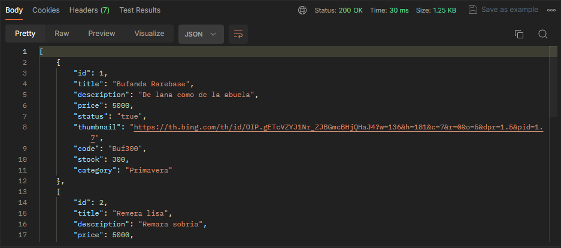

> _LISTA PRODUCTS CON LIMIT_

```
GET: localhost:8080/api/products/?limit=#
```

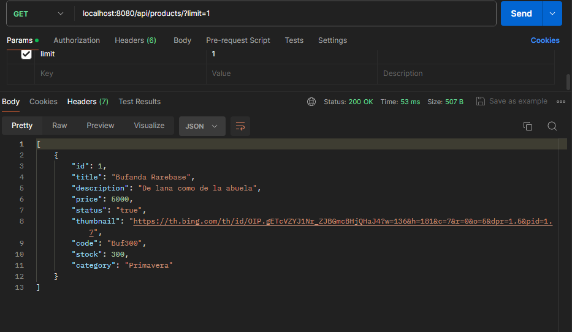

> _PRODUCTO POR ID_

```
GET: localhost:8080/api/products/:id
```

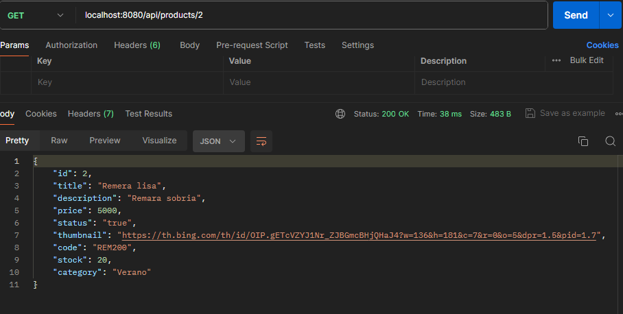

> _AGREGAR PRODUCTO AL "PRODUCTS.JSON"_

```
POST: localhost:8080/api/product
```

#### Si no existe en "Products.json"

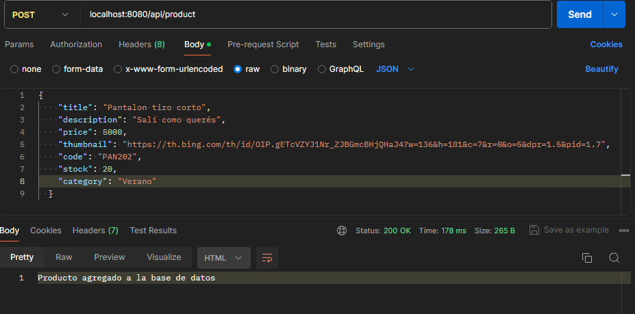

#### Si existe en "Products.json"

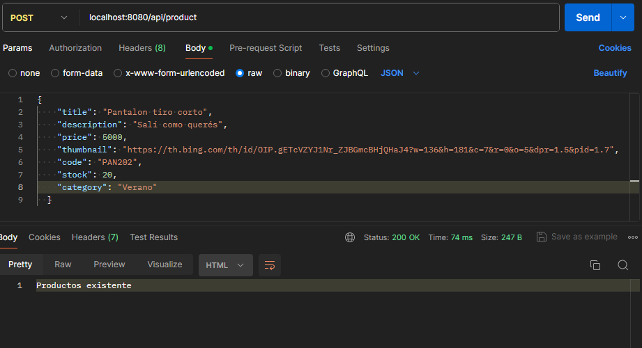

> _ACTUALIZACIÓN DE PRODUCTO EN "PRODUCTS.JSON"_

```
PUT: localhost:8080/api/product/:id
```

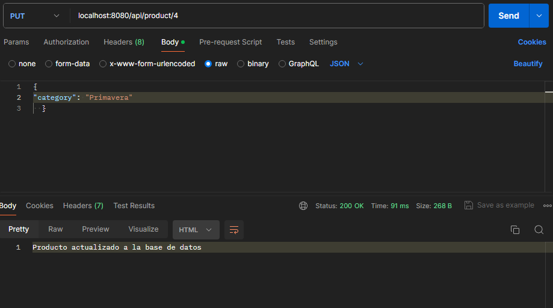

> _ELIMINACION DE PRODUCTO EN "PRODUCT.JS"_

#### Existente en "Products.json"

```
DELETE: localhost:8080/api/product/:id
```

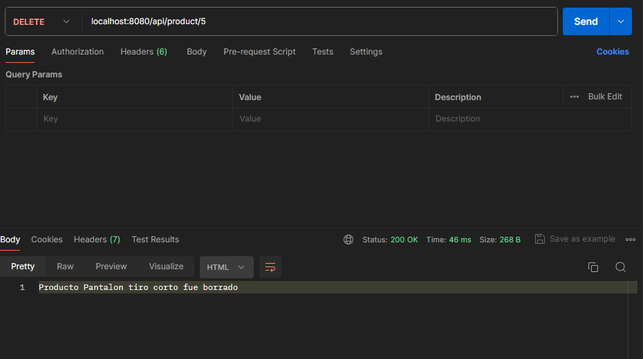

#### Inexistente en "Products.json"

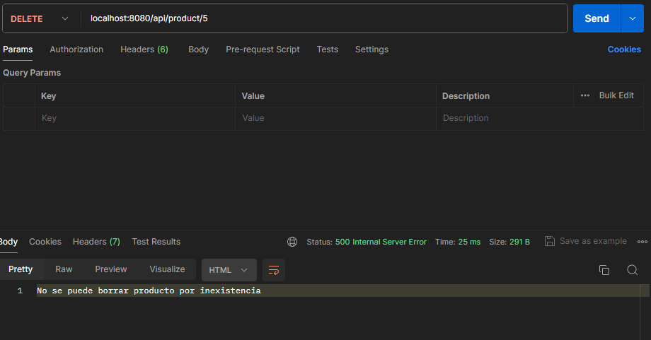

### BASE DE DATOS CARRITOS

> _CREAR UN CARRITO VACIO_

```
POST: localhost:8080/api/carts
```

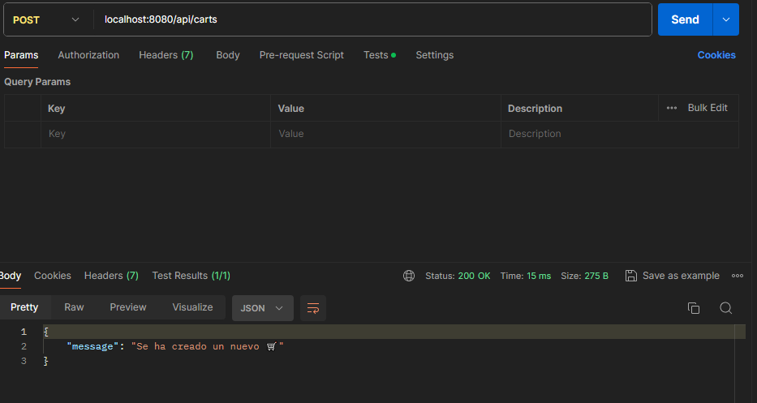

#### Cart.json

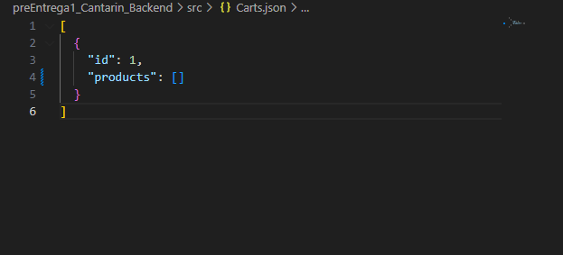

#### Se crea otro carrito con otro id

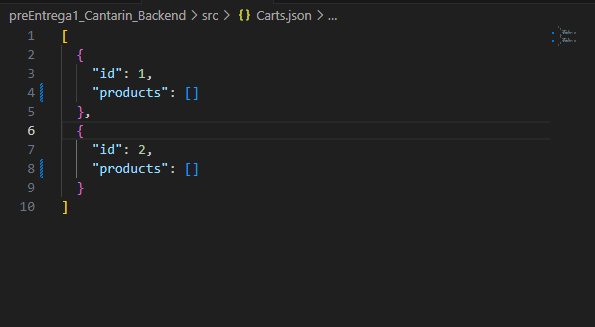

> _LISTA DE PRODUCTOS DE UN CARRITO ESPECÍFICO_

```
GET: localhost:8080/api/carts/:cid
```

#### Existe carrito

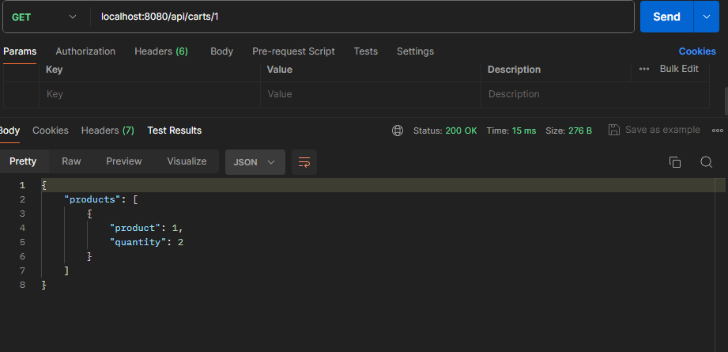

#### No existe carrito

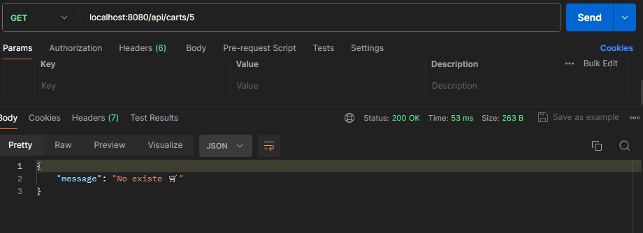

> _AGREGA PRODUCTO A CARRITO Y SUMA CANTIDAD_

```
POST: localhost:8080/api/carts/:cid/product/:pid
```

#### Si existe carrito(agrega sino tira mensaje de que no existe carrito)

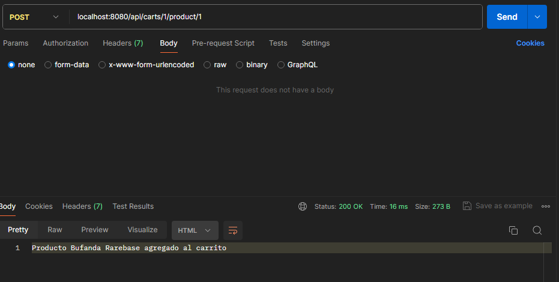

#### Antes de agregar "Carts.json"

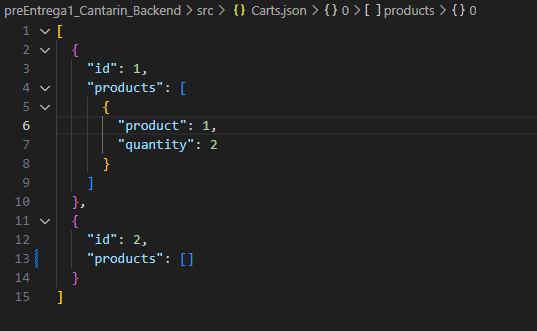

#### Después de agregar "Carts.json"

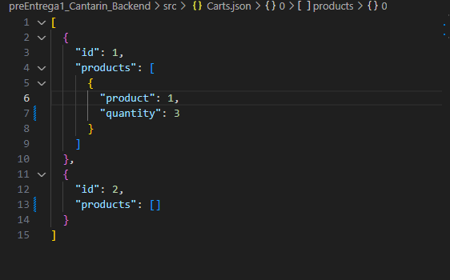

## SEGUNDA PRE ENTREGA

[Link del repositorio click aqui](https://github.com/Pablocan86/preEntregas_Backend_Cantarin/tree/main/preEntrega2_Cantarin_Backend)

### RUTA RAIZ DEVOLUCIÓN OBJETO

```
GET: localhost:8080
```

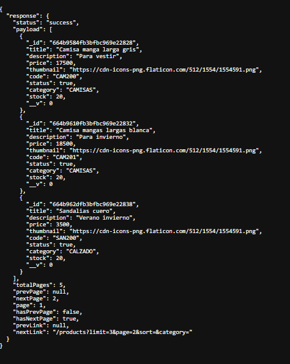

### FILTRO LIMIT+PAGE+SORT+CATEGORY

```
GET: localhost:8080/?limit=2&page=2&sort=asc&category=camisas
```

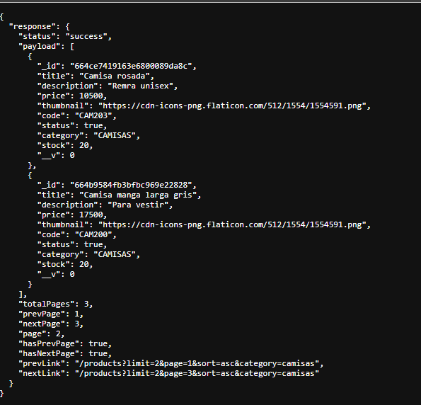

### METODO POST PARA CREAR CARRITO VACIO

```
POST: localhost:8080/carts
```

### METODO DELETE PARA BORRAR PRODUCTO CARRITO

```
DELETE: localhost:8080/carts/(ID de carrito)/products/(_id de producto en carrito)
```

### METODO PUT PARA SUMAR CANTIDAD DE PRODUCTO EXISTENTE

```
PUT: localhost:8080/carts/(ID de carrito)/products/(_id de producto en carrito)
```

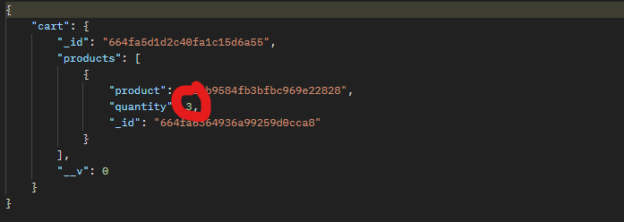
